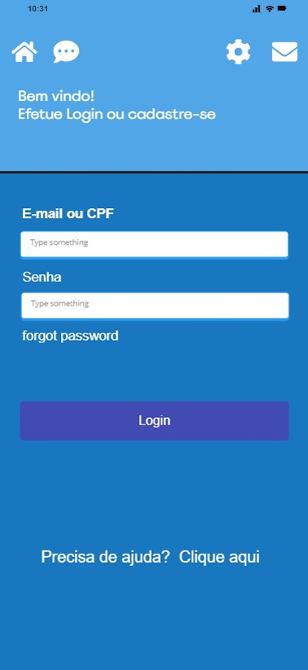
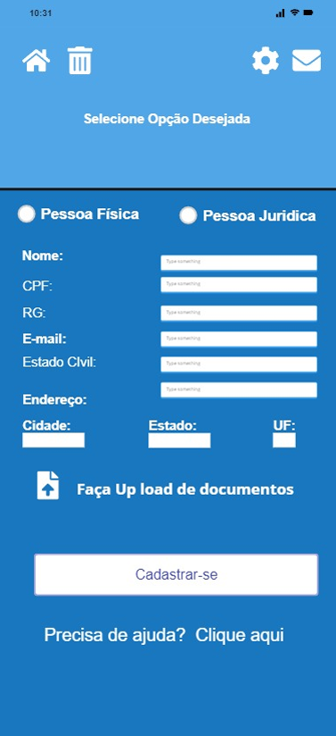
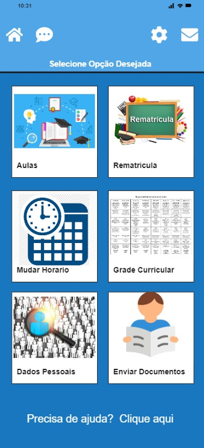
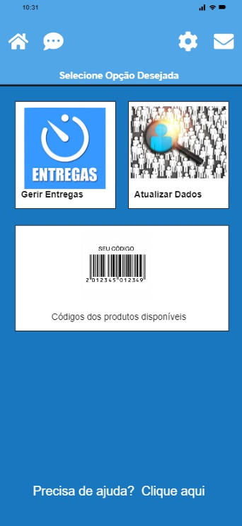
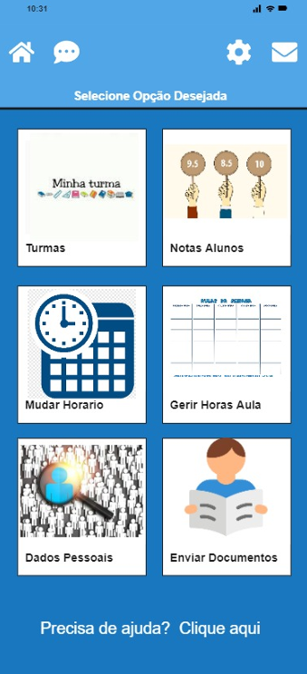
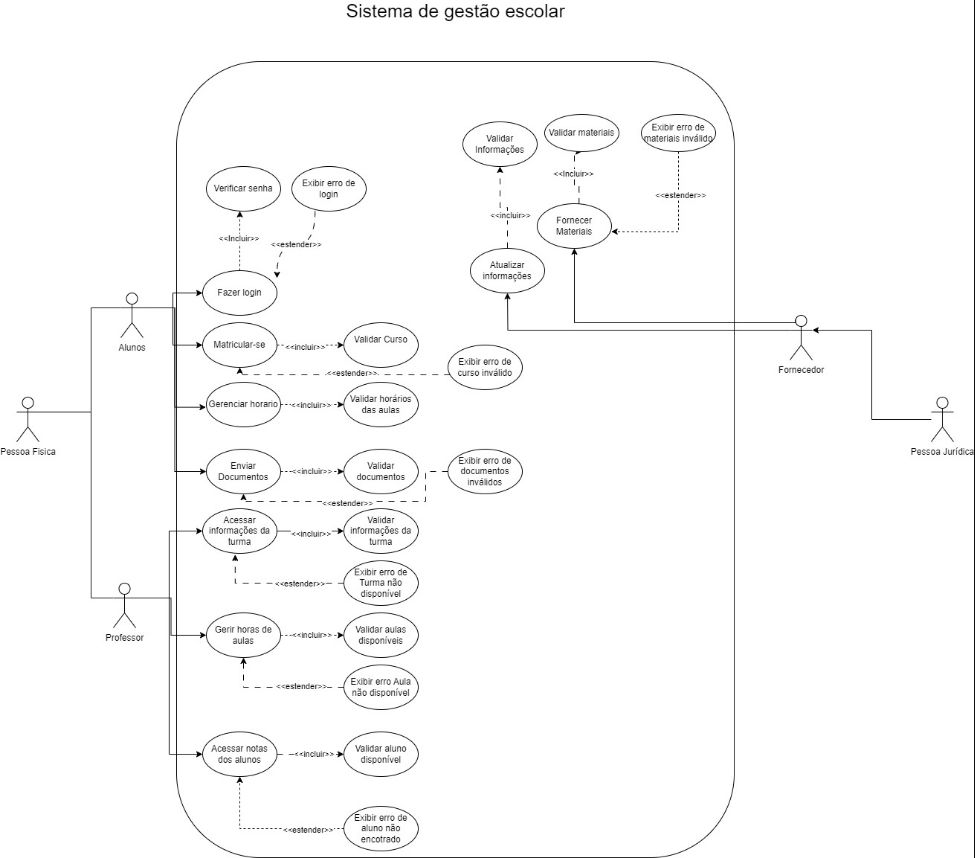

# Projeto Integrador II - Design de Interface

## Descrição do Projeto
O objetivo do projeto foi planejar e desenhar a interface de um aplicativo, além de modelar o sistema utilizando UML para descrever as principais funcionalidades e interações entre os atores e o sistema.

## Objetivo
O objetivo do projeto foi planejar e desenhar a interface de um aplicativo que seja intuitivo, fácil de usar e acessível, alinhando-se com as melhores práticas de design de experiência do usuário (UX).

## Ferramenta Utilizada
- **Miro:** Utilizamos o Miro, para esboçar e criar o layout das telas do aplicativo. Essa ferramenta nos permitiu trabalhar de forma colaborativa, visualizando e ajustando o design em tempo real. (miro.com)

- **Lucidchart:** Para criação do diagrama UML (lucidchart.com).

## Telas Criadas
1. **Tela de Login:**
   - Campos de entrada para nome de usuário e senha.
   - Opção de "Esqueci minha senha" para recuperação de conta.
   - Botão de "Login" para acessar o sistema.

2. **Tela Inicial:**
    - Para cada usuário e seu grupo de atribuição, sendo eles aluno, professor e fornecedor irá ter sua tela inicial personalizada com suas funcionalidades.

3. **Tela de Cadastro:**
   - Campos de entrada para dados pessoais (nome, e-mail, endereço, etc.).
   - Campo para escolha de estado e cidade.
   - Botão de "Cadastrar-se" para concluir o processo de inscrição.

4. **Tela de Upload de Documentos:**
   - Opção para upload de documentos necessários para completar o cadastro.
   - Feedback visual para sucesso ou falha no upload.

## Prototipagem
As telas e o fluxo de navegação foram prototipados no Miro, permitindo uma visão clara do funcionamento do aplicativo e possibilitando ajustes antes da implementação.

## Imagens do Projeto
### Tela de Login

### Tela de Cadastro

### Telas inicial de cada perfil.
#### Aluno

#### Fornecedor

#### Professor

### Conclusão
Este projeto de design no Miro proporcionou uma base sólida para a futura implementação do aplicativo, garantindo que as necessidades dos usuários sejam atendidas com uma interface limpa e funcional.

## Diagrama UML
O diagrama UML a seguir foi criado para representar as interações e casos de uso do sistema, incluindo alunos, professores e fornecedores.

### Descrição do Diagrama
- **Ator Principal:** Aluno - pode fazer login, matricular-se em cursos, gerenciar horários e acessar informações da turma.
- **Outros Atores:** Professor - pode gerenciar horas de aula e acessar notas dos alunos. Fornecedor - responsável pela validação de informações e materiais.

### Diagrama de Casos de Uso

> **Nota:** O diagrama UML acima foi criado para ilustrar as principais funcionalidades e erros que podem ocorrer durante as interações do usuário com o sistema.

> **Observação:** A documentação do diagrama UML completa está no [pdf](./assets/Projeto-Integrador.pdf)

## Equipe
- **Everaldo Rosas:** [Perfil GitHub](https://github.com/EveraldoRosas)
- **Maira Deicke:** [Perfil GitHub](https://github.com/MaiaraDeicke)
- **Lucas Camargo:** [Perfil GitHub](https://github.com/EveraldoRosas)

## Agradecimentos
Gostaríamos de agradecer aos nossos professores e colegas que nos deram suporte durante o desenvolvimento deste projeto.
